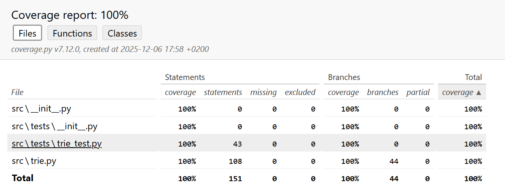

# Testaus

## Yksikkötestaus

Sovelluksen testaus keskittyy yksikkötesteihin, joiden kattavuus on 100% olennaisista toiminnallisuuksista, kattavuusraportti alla. Testauksissa on käytetty erilaisia syötteitä, jotta mahdolliset vaihtoehtoiset metodihaarat saadaan testattua. Kaikkia corner caseja ei tosin varmasti ole katettu.

### Yksikkötestauksen kattavuusraportti

## Koodin muotoilu

Pylint-raportti löytyy tiedostosta docs/Pylint_raportti.md

## Generoitujen lauseiden uniikkius

Mietin miten testaisin generoituja lauseita ja päädyin siihen, että haluan tietää miten usein generoitu lause on suoraan tekstistä. Tällainen tapaus on esimerkiksi silloin jos Markovin ketjun aste on x ja lauseen pituus on sama x sanaa. Tällöin lauseeseen voidaan valita vain peräkkäisiä sanoja ja kyseinen lause kopioidaan sellaisenaan.

Pienemmillä Markovin ketjun asteilla ongelma tulee esiin jos (ja kun tässä tapauksessa) harjoitusdata on liian pieni. Vaikka aste olisi pieni, lauseiksi kopioidaan pääosin valmiita lauseita, jos lauseen sanat eivät esiinny eri lauseiden osana.

### Generoitujen lauseiden testaus

Koska generoitujen lauseiden uniikkiuden testaus on olennainen osa ohjelman laatua, päätin sisällyttää sen ohjelmakoodiin ja käyttäjän toiminnallisuuksiin. Jotta lauseiden muotoilu (esim. erikoismerkkien käsittely harjoitusdatassa) voidaan huomioida, tallennan käsitellyt lauseet listana osana Trie-mallia, jotta tarkistus voidaan myöhemmin tehdä.

Jotta myös käyttäjä voi arvioida mallin toimivuutta ja eri asteiden sekä lausepituuksien vaikutusta lauseiden generointiin, päädyin näyttämään testin tuloksen suoraan käyttäjälle. Mallin ja lauseiden luomisen jälkeen käyttäjä voi tarkistaa miten moni lauseista esiintyy sellaisenaan suoraan harjoitusdatassa.
